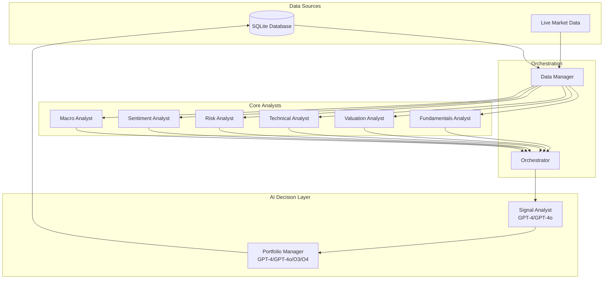
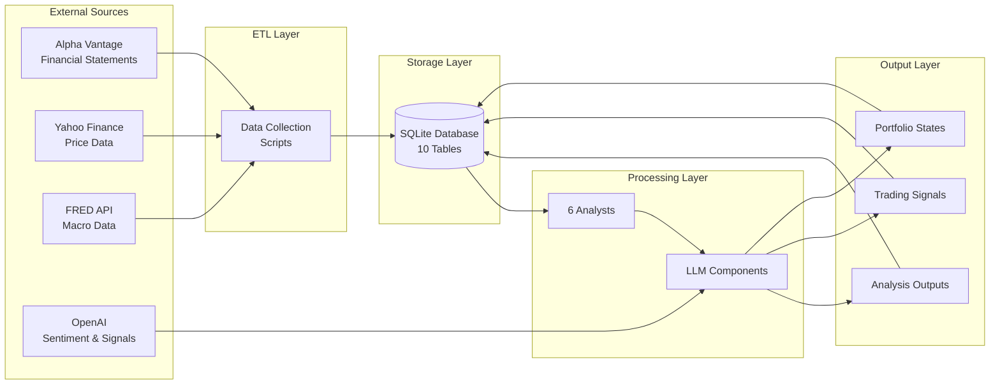
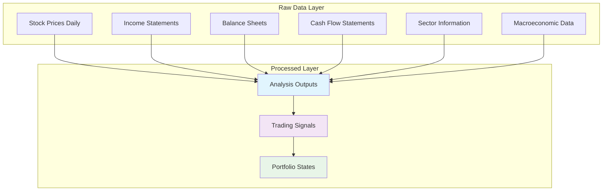
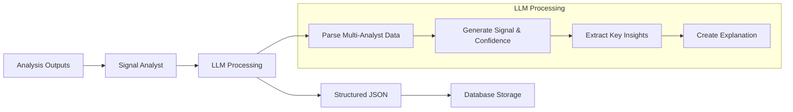
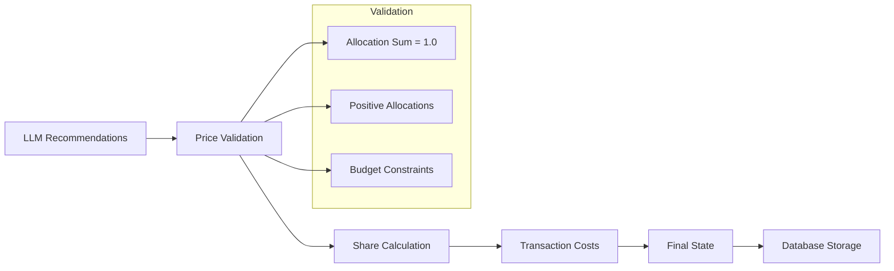
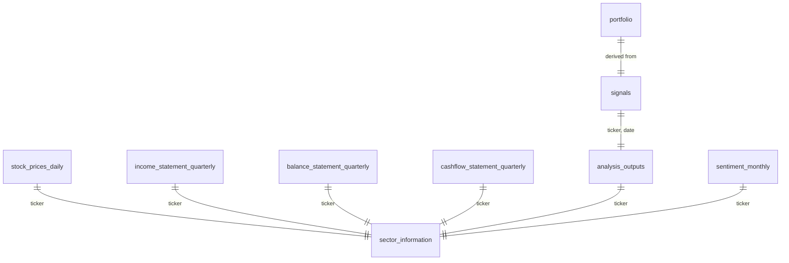

# 🏗️ AI Portfolio Manager (AIPM) - System Architecture

## Table of Contents
1. [System Overview](#system-overview)
2. [Data Architecture & Pipelines](#data-architecture--pipelines)
3. [Core Analysts](#core-analysts)
4. [AI Decision Layer](#ai-decision-layer)
5. [Integration & Orchestration](#integration--orchestration)
6. [Database Schema](#database-schema)

---

## System Overview

The AI Portfolio Manager is a comprehensive quantitative analysis system that combines traditional financial analysis with modern AI/LLM decision-making. The system processes raw financial and market data through six specialized analysts, then uses large language models to generate trading signals and manage portfolios.

### High-Level Architecture



### System Components

| Component | Type | Role | LLM Usage |
|-----------|------|------|-----------|
| **Fundamentals Analyst** | Quantitative | Financial statement analysis | No |
| **Valuation Analyst** | Quantitative | Stock valuation metrics | No |
| **Technical Analyst** | Quantitative | Price/volume pattern analysis | No |
| **Risk Analyst** | Quantitative | Volatility and risk metrics | No |
| **Sentiment Analyst** | Hybrid | News sentiment analysis | Yes (GPT-4o) |
| **Macro Analyst** | Quantitative | Economic indicators | No |
| **Signal Analyst** | AI-Driven | Trading signal generation | Yes (GPT-4o/GPT-4o-mini) |
| **Portfolio Manager** | AI-Driven | Portfolio optimization | Yes (Multiple models) |

### Sector ETF Mapping

The system uses sector ETFs for benchmarking and relative performance calculations across all analysts:

| Sector | ETF Symbol | Description |
|--------|------------|-------------|
| **Communication Services** | XLC | Telecommunications and media companies |
| **Consumer Cyclical** | XLY | Consumer discretionary goods and services |
| **Consumer Defensive** | XLP | Consumer staples and necessities |
| **Energy** | XLE | Energy and oil companies |
| **Financial Services** | XLF | Financial and banking services |
| **Healthcare** | XLV | Healthcare and pharmaceutical companies |
| **Technology** | XLK | Technology companies |

These ETFs are used for:
- **Sector-relative performance metrics** (Fundamentals Analyst)
- **Price and momentum comparisons** (Technical Analyst)  
- **Risk benchmarking** (Risk Analyst)
- **Beta calculations against sector** (Technical/Risk Analysts)

---

## Data Architecture & Pipelines

### Data Flow Pipeline



### Data Dependencies



---

## Core Analysts

### 1. Fundamentals Analyst

**Role**: Analyzes company financial health using TTM (Trailing Twelve Month) calculations from quarterly financial statements.

**Input Data**:
- Income statements (up to 8 quarters for growth calculations)
- Balance sheets (up to 5 quarters for average calculations) 
- Cash flow statements (4 quarters for TTM)
- Sector ETF price data for relative performance

**Metrics Calculated**:

| Metric | Formula | Description |
|--------|---------|-------------|
| **revenue_growth_ttm** | `(Σ total_revenue₁→₄ − Σ total_revenue₀→₃) / Σ total_revenue₀→₃` | Trailing-12-month revenue growth, smoothing seasonal swings |
| **eps_ttm** | `Σ net_income₁→₄ / weighted_avg_shares_outstandingₜₜₘ` | TTM earnings per share, accounting for share-count changes |
| **roe_ttm** | `Σ net_income₁→₄ / ((equity_end₄ + equity_end₀) / 2)` | Annual return on equity using average opening/closing equity |
| **roa_ttm** | `Σ net_income₁→₄ / ((assets_end₄ + assets_end₀) / 2)` | Annual return on assets using average opening/closing assets |
| **gross_margin_ttm** | `Σ gross_profit₁→₄ / Σ total_revenue₁→₄` | TTM gross‑profit margin, smoothing quarter‑to‑quarter volatility |
| **operating_margin_ttm** | `Σ operating_income₁→₄ / Σ total_revenue₁→₄` | TTM operating margin, reflecting core operating efficiency |
| **free_cash_flow_margin_ttm** | `(Σ operating_cashflow₁→₄ − Σ capital_expenditures₁→₄) / Σ total_revenue₁→₄` | Proportion of revenue converted into free cash flow over the year |
| **sector_relative_growth_ttm** | `(revenue₄/revenue₀ − 1) − (ETF_close₄/ETF_close₀ − 1)` | Company's TTM revenue growth vs. sector ETF benchmark |
| **current_ratio** | `current_assets₄ / current_liabilities₄` | Ability to cover short‑term liabilities with current assets |
| **debt_to_equity** | `total_liabilities₄ / total_shareholder_equity₄` | Leverage: amount of debt per unit of equity |

**Real Example Output** (MSFT, 2021-10-01):
```json
{
  "analyst": "fundamentals",
  "metrics": {
    "revenue_growth_ttm": 0.1981,            // 19.81% TTM revenue growth
    "eps_ttm": 8.9434,                       // $8.94 TTM EPS
    "roe_ttm": 0.4467,                       // 44.67% TTM ROE
    "roa_ttm": 0.2024,                       // 20.24% TTM ROA
    "gross_margin_ttm": 0.6886,              // 68.86% TTM gross margin
    "operating_margin_ttm": 0.4214,          // 42.14% TTM operating margin
    "free_cash_flow_margin_ttm": 0.3428,     // 34.28% TTM FCF margin
    "sector_relative_growth_ttm": -0.0701,   // -7.01% vs sector benchmark
    "current_ratio": 2.1648,                 // 2.16x current ratio
    "debt_to_equity": 1.207                  // 1.21x debt-to-equity
  }
}
```

**Implementation Details**:
- **TTM Calculations**: All income/cash flow metrics use trailing 12-month sums from 4 most recent quarters
- **Growth Comparison**: Revenue growth TTM compares current 4 quarters vs previous 4 quarters (requires 8 quarters total)
- **Balance Sheet Ratios**: ROE/ROA use average of opening and closing balances; current/debt ratios use point-in-time values
- **Sector Benchmarking**: Compares company revenue growth against sector ETF price performance over matching periods
- **Data Requirements**: Up to 8 quarters of financial data for complete analysis
- **Missing Data Handling**: Graceful fallbacks and validation for incomplete datasets
- All boolean values converted to integers for JSON serialization

---

### 2. Valuation Analyst

**Role**: Evaluates if stocks are over/under-valued using financial ratios and market data.

**Input Data**:
- Financial statements (latest quarterly)
- Real-time market data (via yfinance)
- Market cap and enterprise value

**Metrics Calculated**:

| Metric | Formula | Description |
|--------|---------|-------------|
| **P/E Ratio** | `Current_Price / EPS` | Price-to-earnings multiple |
| **PEG Ratio** | `PE_Ratio / EPS_Growth_Rate` | Growth-adjusted P/E |
| **Price-to-Book** | `Market_Cap / Book_Value` | Market vs book value |
| **EV/EBITDA** | `Enterprise_Value / EBITDA` | Enterprise multiple |
| **Price-to-Sales** | `Market_Cap / Revenue` | Revenue multiple |
| **Price/FCF** | `Market_Cap / Free_Cash_Flow` | Free cash flow multiple |

**Real Example Output** (MSFT, 2021-10-01):
```json
{
  "analyst": "valuation", 
  "metrics": {
    "price_earnings_ratio": 25.21,          // 25.21x P/E ratio (using previous day price $273.24)
    "pe_growth_ratio": 1.02,                // 1.02 PEG ratio (growth fairly priced)
    "price_book_ratio": 13.36,              // 13.36x price-to-book
    "ev_ebitda_ratio": 21.96,               // 21.96x EV/EBITDA
    "price_sales_ratio": 11.2,              // 11.2x price-to-sales
    "price_fcf_ratio": 20.69                // 20.69x price/FCF
  }
}
```

**Implementation Details**:
- Uses yfinance for real-time market data
- Annualizes quarterly financial data (× 4)
- Handles division by zero with graceful defaults
- Calculates growth rates from consecutive quarters

---

### 3. Technical Analyst

**Role**: Analyzes price trends, momentum, and volume patterns.

**Input Data**:
- Daily stock prices (OHLCV)
- Sector ETF prices for comparison
- Volume data

**Metrics Calculated**:

| Metric | Formula | Description |
|--------|---------|-------------|
| **12M Momentum** | `(Price_t - Price_t-252) / Price_t-252` | 12-month price momentum |
| **MA 50/200 Ratio** | `MA50 / MA200` | Moving average ratio (>1.0 indicates bullish trend) |
| **RSI (14D)** | `100 - (100 / (1 + RS))` where `RS = Avg_Gain / Avg_Loss` | Relative strength index |
| **MACD Line** | `EMA12 - EMA26` | Moving average convergence divergence |
| **Volume Trend** | `Avg_Volume_30D / Avg_Volume_90D` | Volume trend classification |
| **Bollinger Band Width** | `(Upper_Band - Lower_Band) / Middle_Band` | Volatility measure |
| **Price vs Sector** | `Stock_Price / Sector_ETF_Price` | Relative strength |
| **Momentum vs Sector** | `Stock_Return_12M - Sector_Return_12M` | Relative momentum |
| **Beta vs Sector** | `Cov(Stock, Sector) / Var(Sector)` | Sector correlation |

**Real Example Output** (MSFT, 2021-10-01):
```json
{
  "analyst": "technical",
  "metrics": {
    "price_momentum_12m": 0.3391,           // 33.91% 12-month momentum
    "ma_50_200_ratio": 1.1472,              // 1.1472 MA ratio (bullish structure)
    "rsi_14d": 32.19,                       // 32.19 RSI (oversold during correction)
    "macd_line": -2.1242,                   // -2.12 MACD (momentum weakness in pullback)
    "volume_trend_30d": "neutral",          // Neutral volume trend
    "bb_width_pct": 0.0859,                 // 8.59% Bollinger Band width
    "price_vs_sector_ratio": 1.8867,        // 1.89x sector outperformance
    "momentum_vs_sector": 0.0628,           // 6.28% vs sector momentum
    "beta_vs_sector": 0.9799                // 0.98 sector beta
  }
}
```

**Implementation Details**:
- **Technical Libraries**: Uses TA-Lib library for RSI, MACD, and other standard indicators
- **Data Requirements**: Minimum data points enforced for each calculation (200+ for MA ratios)
- **Enhanced Calculations**:
  - **MA 50/200 Ratio**: Fixed to return actual ratio (e.g., 1.1472) instead of boolean crossover flag
  - **Market Context Awareness**: RSI and MACD values correctly reflect correction periods (oversold RSI ~32, negative MACD during pullbacks)
  - **Debug Logging**: Enhanced logging shows MA values and calculated ratios for transparency
- **Classification Logic**: Volume trend classified as "up", "down", or "neutral" based on 30d vs 90d averages
- **Sector Comparisons**: Uses sector ETF price data for relative strength and momentum calculations
- **Correction Period Handling**: Indicators properly reflect short-term weakness within longer-term uptrends

---

### 4. Risk Analyst

**Role**: Quantifies volatility, downside risk, and risk-adjusted returns.

**Input Data**:
- Daily stock prices and returns
- Market data (SPY) for beta calculation
- Sector ETF data for relative metrics
- Risk-free rate from macro data

**Metrics Calculated**:

| Metric | Formula | Description |
|--------|---------|-------------|
| **Market Beta** | `Cov(Stock, Market) / Var(Market)` | Market correlation coefficient |
| **30D Volatility** | `StdDev(Returns_30D) × √252` | Annualized volatility |
| **Max Drawdown** | `min((Price_t / CumMax_t) - 1)` | Maximum peak-to-trough decline |
| **Sharpe Ratio** | `(Return - RiskFree) / Volatility` | Risk-adjusted return |
| **Sortino Ratio** | `(Return - RiskFree) / Downside_Dev` | Downside risk-adjusted return |
| **CVaR (95%)** | `E[Return | Return ≤ VaR_95%]` | Conditional Value at Risk |
| **Idiosyncratic Vol** | `Stock_Vol - (Beta² × Sector_Vol)` | Company-specific risk |
| **Drawdown vs Sector** | `Stock_Drawdown - Sector_Drawdown` | Relative drawdown |
| **Tracking Error** | `StdDev(Stock_Returns - Sector_Returns) × √252` | Annualized deviation from sector |

**Real Example Output** (MSFT, 2021-10-01):
```json
{
  "analyst": "risk",
  "metrics": {
    "market_beta": 1.1506,                  // 1.15 market beta
    "volatility_30d_pct": 0.1962,           // 19.62% annualized volatility
    "max_drawdown_pct": -0.2804,            // -28.04% maximum drawdown (peak: $295.82, trough: $129.38)
    "sharpe_ratio": 1.1053,                 // 1.11 Sharpe ratio
    "sortino_ratio": 1.4367,                // 1.44 Sortino ratio
    "cvar_95_pct": -0.0519,                 // -5.19% CVaR
    "idiosyncratic_vol_pct": 0.183213,      // 18.32% idiosyncratic volatility
    "drawdown_vs_sector_pct": 0.0311,       // 3.11% better than sector
    "tracking_error_pct": 0.0937            // 9.37% annualized tracking error vs XLK
  }
}
```

**Implementation Details**:
- **Annualization**: Uses 252 trading days for volatility and tracking error calculations
- **Risk-Free Rate**: Retrieved from FRED macro data (3M Treasury yield)
- **Data Requirements**: Minimum 30 data points with proper time series alignment
- **Enhanced Calculations**:
  - **Tracking Error**: Properly annualized using √252 scaling factor for industry compliance
  - **Max Drawdown**: Enhanced peak-to-trough calculation with running maximum tracking and debug logging
  - **Date Handling**: Ensures chronological ordering for accurate drawdown calculation
  - **Full Period Analysis**: Uses complete dataset for tracking error vs sector ETF
- **Error Handling**: Graceful degradation with default values when insufficient data

---

### 5. Sentiment Analyst

**Role**: Analyzes news sentiment using LLM-powered web search and analysis.

**LLM Usage**: GPT-4o with web search capabilities  
**Prompt Location**: `prompts/sentiment_analyst_prompt.txt`

**Input Data**:
- Company name and ticker
- Analysis date
- Web search results from OpenAI

**Process**:
1. Searches for news articles in the month prior to analysis date
2. Uses GPT-4o to analyze sentiment of found articles
3. Returns sentiment score (-2 to +2) and explanation

**Metrics Calculated**:

| Metric | Range | Description |
|--------|-------|-------------|
| **Sentiment Score** | -2 to +2 | Integer sentiment from very negative to very positive |
| **Sentiment Explanation** | Text | Up to 100 words explaining the sentiment reasoning |

**Real Example Output** (MSFT, 2021-09-01):
```json
{
  "analyst": "sentiment",
  "metrics": {
    "sentiment_score": -1,                  // Negative sentiment
    "sentiment_explanation": "In July 2021, Microsoft faced several challenges: the Pentagon canceled its $10 billion JEDI cloud contract, citing evolving needs; the company addressed 117 security vulnerabilities, including the critical 'PrintNightmare' flaw; and the U.S. and allies formally accused China of exploiting Microsoft Exchange Server vulnerabilities for cyber espionage. These developments likely contributed to a negative sentiment affecting Microsoft's stock price in the subsequent period."
  }
}
```

**Implementation Details**:
- Uses OpenAI's web search preview tool
- Searches for company-specific news in prior month
- Returns null sentiment if no relevant news found
- Saves results to database for historical analysis
- Falls back to database lookup for historical dates

---

### 6. Macro Analyst

**Role**: Provides comprehensive economic context using a minimal set of 7 core macroeconomic indicators covering growth, price, labor, policy, yield curve, credit risk, and market volatility.

**Input Data**:
- Precomputed macroeconomic indicators from DataManager via FRED API
- Core economic indicators: GDP growth, inflation, unemployment, fed funds rate
- Market indicators: Treasury yield curve, credit spreads, volatility index

**Metrics Calculated**:

| Metric Name | Formula | Explanation |
|-------------|---------|-------------|
| **gdp_growth_pct** | ((GDP_Q – GDP_Q–1) / GDP_Q–1) × 100, where GDP_Q is real GDP for the quarter containing or immediately before the analysis_date, and GDP_Q–1 is the prior quarter. | Annualized quarter-over-quarter GDP growth rate at the backtest date, expressed as a percentage. |
| **inflation_yoy_pct** | ((CPI_M – CPI_M–12) / CPI_M–12) × 100, where CPI_M is the CPI level for the month containing the analysis_date and CPI_M–12 is 12 months earlier. | Year-over-year inflation rate at the backtest month, expressed as a percentage. |
| **unemployment_rate_pct** | UnemploymentRate_M, where M is the last available month on or before the analysis_date. | Official monthly unemployment rate at the backtest date, expressed as a percentage. |
| **fed_funds_rate_pct** | FedFundsRate_D, where D is the last available business-day rate on or before the analysis_date. | Effective federal funds rate at the backtest date, expressed as a percentage. |
| **yield_spread_pct** | Yield10Y_D – Yield3M_D, where each yield is observed on the last business day on or before the analysis_date. | Slope of the Treasury yield curve (10-year minus 3-month) at the backtest date, in percentage points. |
| **credit_spread_bp** | BAA_Corp_Yield_D – Yield10Y_D, where each yield is observed on the last business day on or before the analysis_date. | Spread (in basis points) between BAA corporate bonds and 10‑year Treasuries, signaling credit risk. |
| **vix_index** | VIX_D, where VIX_D is the CBOE Volatility Index on the last business day on or before the analysis_date. | Chicago Board Options Exchange Volatility Index, a gauge of market-implied volatility. |

**FRED Series Mapping**:
- `gdp_growth_pct`: A191RL1Q225SBEA (Quarterly GDP growth, annualized, seasonally adjusted)
- `inflation_yoy_pct`: CPIAUCSL (Consumer Price Index, YoY calculated)  
- `unemployment_rate_pct`: UNRATE (Unemployment rate, monthly)
- `fed_funds_rate_pct`: FEDFUNDS (Federal funds rate, monthly)
- `yield_spread_pct`: GS10 - GS3M (10Y minus 3M Treasury rates)
- `credit_spread_bp`: BAA - GS10 (BAA corporate yield minus 10Y Treasury)
- `vix_index`: VIXCLS (CBOE Volatility Index)

**Real Example Output** (2021-10-01):
```json
{
  "analyst": "macro",
  "metrics": {
    "gdp_growth_pct": 7.4,                 // 7.4% annualized GDP growth (strong expansion)
    "inflation_yoy_pct": 6.23,             // 6.23% YoY inflation rate (elevated levels)
    "unemployment_rate_pct": 4.5,          // 4.5% unemployment rate (recovering labor market)
    "fed_funds_rate_pct": 0.08,            // 0.08% fed funds rate (accommodative policy)
    "yield_spread_pct": 1.19,              // 1.19% yield curve slope (10Y-3M)
    "credit_spread_bp": 177.0,             // 177 bp credit spread (moderate risk premium)
    "vix_index": 21.15                     // 21.15 VIX volatility index (elevated uncertainty)
  }
}
```

**Implementation Details**:
- **Minimal Core Set**: Focuses on 7 essential metrics covering growth, price, labor, policy, curve, credit, and volatility
- **Explicit Date Alignment**: Uses `pandas.asof()` method for backtesting accuracy with analysis_date reference
- **Unit Consistency**: Percentages rounded to 2 decimal places, credit spreads in basis points
- **Credit Risk Assessment**: BAA corporate yield minus 10Y Treasury spread measures credit market stress
- **Market Volatility**: VIX index provides forward-looking volatility expectations
- **Error Handling**: 30-day lookback window with explicit warnings for missing data
- **Backtesting Optimization**: Each metric uses proper historical point-in-time data alignment

---

## AI Decision Layer

### Signal Analyst

**Role**: Generates trading signals from multi-analyst outputs using LLM reasoning.

**LLM Usage**: GPT-4o or GPT-4o-mini (structured JSON output required)  
**Prompt Location**: `prompts/signal_analyst_prompt.txt`

**Input Format**:
Complete analysis output from all 6 analysts (JSON format)

**Output Format**:
```json
{
  "ticker": "string",
  "analysis_date": "YYYY-MM-DD", 
  "closing_price": "float",
  "signal": "strong_buy|buy|hold|sell|strong_sell",
  "confidence": "float (0.0-1.0)",
  "time_horizon": "1M|3M|6M",
  "explanation": "string (justification paragraph)",
  "key_insights": {
    "fundamentals": ["insight1", "insight2"],
    "valuation": ["insight1", "insight2"],
    "technical": ["insight1", "insight2"],
    "risk": ["insight1", "insight2"],  
    "sentiment": ["insight1", "insight2"],
    "macro": ["insight1", "insight2"]
  }
}
```

**Real Example Input/Output** (MSFT, 2021-01-01):

*Input*: Complete analysis output with all 6 analyst results

*Output*:
```json
{
  "ticker": "MSFT",
  "analysis_date": "2021-10-01",
  "closing_price": 273.24090576171875,
  "signal": "buy",
  "confidence": 0.88,
  "time_horizon": "3M",
  "explanation": "Microsoft's strong fundamentals, including high operating margins and robust ROE, are complemented by positive sentiment from recent product launches and strategic acquisitions. The valuation is reasonable given the growth prospects, and technical indicators suggest potential for a rebound. Risk metrics are favorable, with a solid Sharpe ratio, and macroeconomic conditions remain supportive.",
  "key_insights": {
    "fundamentals": [
      "Operating margin of 42.14% indicates strong profitability",
      "ROE of 44.67% reflects efficient use of equity",
      "Current ratio of 2.16 suggests strong liquidity position"
    ],
    "valuation": [
      "P/E ratio of 25.21 is reasonable given growth prospects",
      "PEG ratio of 1.02 indicates growth is fairly priced",
      "Price to free cash flow ratio of 20.69 supports valuation"
    ],
    "technical": [
      "RSI of 32.19 suggests the stock is near oversold territory",
      "12-month price momentum of 33.91% indicates strong price performance",
      "50/200 MA ratio of 1.1472 shows a bullish trend"
    ],
    "risk": [
      "Sharpe ratio of 1.1053 indicates favorable risk-adjusted returns",
      "Market beta of 1.1506 suggests moderate market correlation",
      "Sortino ratio of 1.4367 highlights good downside protection"
    ],
    "sentiment": [
      "Positive sentiment from new product launches and acquisitions",
      "11% increase in quarterly dividend boosts investor confidence"
    ],
    "macro": [
      "GDP growth at 7.4% supports economic expansion",
      "Unemployment rate at 4.5% indicates a recovering labor market",
      "Fed funds rate at 0.08% remains accommodative"
    ]
  }
}
```

**Process Flow**:


---

### Portfolio Manager

**Role**: Creates and manages portfolios using LLM-driven optimization with signal inputs.

**LLM Usage**: Multiple models supported - GPT-4o (default), GPT-4o-mini, GPT-4.1, GPT-4.1-mini, O3-mini, O4-mini, GPT-5  
**Prompt Location**: `prompts/portfolio_creation_prompt.txt`, `prompts/portfolio_rebalance_prompt.txt`

**Supported Operations**:
1. **Portfolio Creation** - Initial portfolio construction
2. **Portfolio Rebalancing** - Periodic rebalancing based on new signals
3. **Portfolio Management** - Full lifecycle management with periodic rebalancing

**Input Format** (Portfolio Creation):
```json
{
  "date": "2021-01-01",
  "num_tickers": 3,
  "risk_preference": "normal",
  "sector_preference": ["Information Technology", "Healthcare"],
  "signals": [
    {
      "ticker": "AAPL",
      "signal": "buy",
      "confidence": 0.88,
      "time_horizon": "3M",
      "explanation": "...",
      "key_insights": {...}
    }
  ]
}
```

**Output Format**:
```json
{
  "action": "create",
  "date": "2021-10-01",
  "portfolio_value": 100000.0,
  "transaction_fees": 200.0,
  "allocations": [
    {
      "ticker": "AAPL",
      "allocation": 0.15,
      "shares": 108.16,
      "stock_price": 138.68,
      "value": 15000,
      "justification": "Strong technology sector leader with consistent performance"
    },
    {
      "ticker": "MSFT",
      "allocation": 0.15,
      "shares": 54.90,
      "stock_price": 273.24,
      "value": 15000,
      "justification": "Buy signal (0.88) with strong fundamentals and reasonable valuation"
    },
    {
      "ticker": "GOOGL",
      "allocation": 0.15,
      "shares": 112.88,
      "stock_price": 132.88,
      "value": 15000,
      "justification": "Technology diversification with growth potential"
    },
    {
      "ticker": "TSLA",
      "allocation": 0.10,
      "shares": 38.69,
      "stock_price": 258.49,
      "value": 10000,
      "justification": "High-growth electric vehicle sector exposure"
    },
    {
      "ticker": "NVDA",
      "allocation": 0.05,
      "shares": 241.83,
      "stock_price": 20.68,
      "value": 5000,
      "justification": "Semiconductor exposure with AI/data center growth"
    },
    {
      "ticker": "CASH",
      "allocation": 0.00,
      "value": 0,
      "justification": "Fully invested given favorable market conditions"
    }
  ],
  "summary": "Diversified technology-heavy portfolio with equal 15% weights in AAPL, MSFT, and GOOGL as core holdings. TSLA provides EV exposure at 10%, while smaller positions in NVDA (5%) and other tech stocks complete the allocation. Strong GDP growth of 7.4% and accommodative Fed policy support this growth-oriented allocation."
}
```

**Portfolio State Management**:


**Implementation Details**:
- Supports up to 5 retry attempts for validation failures
- Calculates actual shares based on closing prices
- Applies 0.2% transaction costs
- Maintains full audit trail in database
- Handles cash allocation as residual

---

## Integration & Orchestration

### Orchestrator Component

**Role**: Coordinates all analysts and manages dependencies automatically.

**Key Features**:

1. **Automatic Dependency Management**
   - Creates missing analysis outputs when needed
   - Generates missing signals for portfolio operations
   - Validates raw data availability

2. **Error Handling**
   - Database not found errors with setup instructions
   - Raw data missing errors with CLI command references
   - Graceful fallbacks for analyst failures

3. **Workflow Coordination**
   ```mermaid
   graph TD
       A[User Request] --> B{Check Dependencies}
       B -->|Missing Analysis| C[Run Analysts]
       B -->|Missing Signals| D[Generate Signals]  
       B -->|Missing Raw Data| E[Throw Error]
       C --> F[Save to Database]
       D --> F
       F --> G[Continue Workflow]
       E --> H[Display Error Message]
   ```

**Dependency Resolution**:
- **Portfolio Operations** → Need Signals → Need Analysis Outputs → Need Raw Data
- **Signal Generation** → Need Analysis Outputs → Need Raw Data
- **Analysis** → Need Raw Data

---

## Database Schema

### Core Tables

| Table | Purpose | Key Fields |
|-------|---------|------------|
| `stock_prices_daily` | OHLCV price data | ticker, date, close, volume |
| `income_statement_quarterly` | Income statements | ticker, report_date, total_revenue, net_income |
| `balance_statement_quarterly` | Balance sheets | ticker, report_date, total_assets, total_shareholder_equity |
| `cashflow_statement_quarterly` | Cash flow statements | ticker, report_date, operating_cashflow |
| `sector_information` | Company metadata | ticker, sector, industry, sector_etf |
| `macroeconomic_monthly` | Economic indicators | date, gdp_growth, inflation_yoy, fed_funds_rate |
| `analysis_outputs` | Analyst results | ticker, date, analysis_output (JSON) |
| `signals` | Trading signals | ticker, date, signal (JSON) |
| `portfolio` | Portfolio states | portfolio_name, date, state (JSON) |
| `sentiment_monthly` | Sentiment data | ticker, date, sentiment, explanation |

### Data Relationships



---

## Performance Characteristics

### Processing Times
- **Single Analyst**: ~5-10 seconds per ticker
- **Complete Analysis**: ~30-60 seconds per ticker
- **Signal Generation**: ~10-20 seconds (LLM dependent)
- **Portfolio Creation**: ~15-30 seconds (LLM dependent)

### Scalability
- **Database**: SQLite handles up to millions of records efficiently
- **Batch Processing**: Linear scaling with ticker count
- **Memory Usage**: ~100-200MB per analysis
- **API Limits**: Constrained by external API rate limits

### Error Recovery
- **Retry Logic**: 5 attempts for portfolio validation failures
- **Graceful Degradation**: Default values when data unavailable
- **Audit Trails**: Complete logging of all operations
- **Dependency Validation**: Pre-flight checks before processing

---

## 🎯 Backtesting Integrity

**All analysts now implement proper backtesting data handling to ensure accurate historical analysis:**

### Previous Trading Day Logic
- **Technical Analyst**: Uses price data up to `analysis_date - 1 day` for all calculations
- **Risk Analyst**: Risk metrics computed using only previous trading day data  
- **Fundamentals Analyst**: Sector price comparisons use backtesting-aware data handling
- **Valuation Analyst**: Market cap and valuation ratios use previous trading day closing prices
- **Macro Analyst**: Uses `.asof()` method for proper time-series alignment

### Implementation Details
- All price queries end with `analysis_date - 1 day + ' 23:59:59'` to ensure SQL BETWEEN query includes the end date
- Ensures no "future" information leakage in backtesting scenarios
- Maintains consistency across all price-sensitive analysts
- Follows the principle that on any analysis date, only data available to traders at the end of the previous trading day is used

This architecture enables robust, scalable quantitative analysis with modern AI decision-making capabilities and proper backtesting integrity, providing a comprehensive foundation for systematic investment management. 